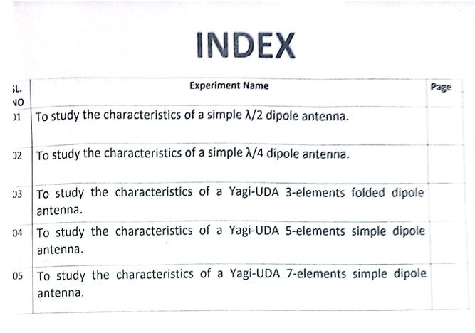

# ANTENA-ENGINEERING

[![Youtube][youtube-shield]][youtube-url]
[![Facebook][facebook-shield]][facebook-url]
[![Instagram][instagram-shield]][instagram-url]
[![LinkedIn][linkedin-shield]][linkedin-url]

Thanks for visiting my GitHub account!

 An **antenna** is a metallic structure that captures and/or transmits radio electromagnetic waves. Antennas come in all shapes and sizes from little ones that can be found on your roof to watch TV to really big ones that capture signals from satellites millions of miles away.

The antennas that Space Communications and Navigation (SCaN) uses are a special bowl shaped antenna that focuses signals at a single point called a parabolic antenna. The bowl shape is what allows the antennas to both capture and transmit electromagnetic waves. These antennas move horizontally (measured in hour angle/declination) and vertically (measured in azimuth/elevation) in order to capture and transmit the signal.

## Source Code (Download)

[Click Here](https://mega.nz/folder/tL00VSoQ#E4snCVQ3MAKOd-Nss7sWEA)

## Project Features

|                              |
| :--------------------------: |
|  |

## Follow Me

    

<!-- MARKDOWN LINKS & IMAGES -->

[youtube-shield]: https://img.shields.io/badge/-Youtube-black.svg?style=flat-square&logo=youtube&color=555&logoColor=white
[youtube-url]: https://youtube.com/@learnwithfair
[facebook-shield]: https://img.shields.io/badge/-Facebook-black.svg?style=flat-square&logo=facebook&color=555&logoColor=white
[facebook-url]: https://facebook.com/learnwithfair
[instagram-shield]: https://img.shields.io/badge/-Instagram-black.svg?style=flat-square&logo=instagram&color=555&logoColor=white
[instagram-url]: https://instagram.com/learnwithfair
[linkedin-shield]: https://img.shields.io/badge/-LinkedIn-black.svg?style=flat-square&logo=linkedin&colorB=555
[linkedin-url]: https://linkedin.com/company/learnwithfair
